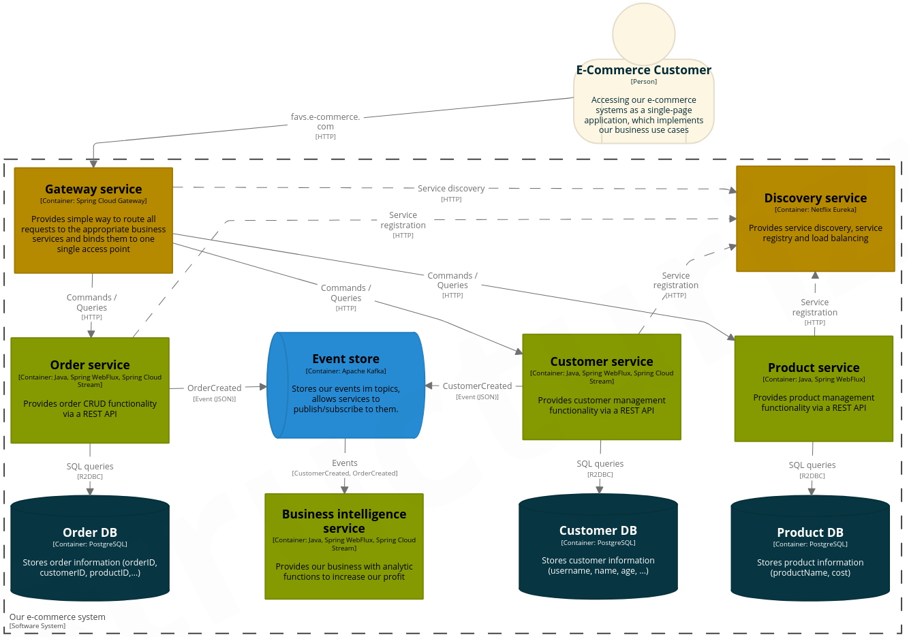

# FAVS-commerce

FAVS-commerce is a small event-driven/reactive microservice e-commerce system showcasing several concepts of typical event-driven architectures, with focus on the concepts "Event Sourcing" (ES) and "Command Query Responsibility Segregation" (CQRS).
It was implemented as part of an exam for the module "Advanced aspects of distributed systems" in WS20/21 at Hochschule Hannover.

## Architecture overview

This example aims to implement an e-commerce shop.
The e-commerce shop's domain is rather simple model as it just comprises of customers, orders and products, but there is a high degree of complexity involved due to the fact that each domain is tightly coupled with each other.
Each customer is able to place orders for specific products, i.e. a customer has a list of orders they placed in the past, which each order having a list of products.
If each of these domains is implemented as a single microservice, that means that in order to place an order for a specific customer, the `OrderService` would have to ask the `CustomerService` if the specified customerId exists and repeat the same with the `ProductService` and the specified productId.
Without the right architectural practice, this could degrade into a tightly coupled system where each microservice would have to directly interact with the other ones in order to send HTTP requests on REST APIs.

This could quickly degrade into a unmaintable system if we imagine a bigger scope for our system, something like Amazon.
For a large amount of customers we would need to scale up our system from one instance to many instances, maybe even set up in different data centers closer to the individual customer's country.
The Operations department would have to work tightly with the Development department to figure out a way how multiple scaled up instances of our services can interact with each other without losing data consistency, making sure how each service can reach one of the multiple available instances other services it needs to interact with.

With the correct event-driven architecture, this gets drastically more simple, as none of the microservices are interacting with each other. They simply emit events that describe what has happened.
If a new customer has created themself an account on our shop, the `CustomerService` simply publishes an `CustomerCreatedEvent` to the event broker and each microservice subscribe to these events and perform the needed actions.
For example, a `OrderService` would subscribe to these `CustomerCreatedEvent`s to locally save the ids of created customer to make sure that orders cannot be created for an non-existent customer.
Scaling up multiple instances of a specific service is a non-factor then.
Multiple `CustomerService`s can simply be started, a load-balancer on top of these will figure how which one of these instances will handle the creation of the new customer and that instance will simply publish the appropriate event to the event bus.
Now, if we have scaled up the `OrderService` to multiple instances, they all can simply subscribe to this newly published event.

While the scope of this system is rather small and the example above could seem constructed specially to fit such a use case, one can still imagine the event-driven architecture being a valid architecture solution for such a system.

The following diagram displays the whole event-driven system, including which microservices it is made of and how they are interacting:

## Project organization

For this project, a group of 5 was formed and the task was to create an interesting project on the topic of "event-driven (reactive) services".
The group decided that one interesting topic of such systems is how they handle data that needs to persisted across multiple services and what concepts might help to do so.
During the research a consensus around the concepts "Event Sourcing" and "Command Query Responsibility Segregation" was formed.
This system was created solely for said project, but implemented only by one of the group members.
Additionally there was a paper and a presentation to be created were everybody contributed.

## Repository organization

This repository is set up as a [Monorepo][monorepo].
This means, that every single line of source code for each software artifact, i.e. our microservices and their commons, are stored in this very repository.

### Folder organization

* [./adrs](./adrs): Contains ["Architectural Decision Records"][adr] that describe decisions made that address (non)-functional requirements that are architecturally signifcant.
* [./application](./application): Contains the e-commerce system itself
* [./documentation](./documentation): Contains all documentation documents and created diagrams, e.g. requirements needed, a usage guide, used technologies, how to develop/deploy.

## How to start

To start this system, open up a shell, switch into the [./application](./application) directory and execute `docker-compose up -d`.
This starts up all needed microservices and all other infrastructure services needed to allow the system to work correctly.

You can follow the start up process via `docker-compose logs -f` which simply displays all logs of each service.

## How to interact with the system

As there is currently no GUI, the only way to interact with this system is by directly sending HTTP requests to the appropriate REST API endpoints.
For specific use cases and their corresponding `cURL` command, see [./documentation/how-to-use.md](./documentation/how-to-use.md).

As products are needed to allow customers to place orders, a script has been provided to insert a few test products: [insertDefaultProducts.sh](./application/deployment/scripts/insertDefaultProducts.sh)

## Further information

All further information is described in an appropriate document inside the [./documentation](./documentation) directory.

The following topics can be viewed there:

* Architectural high-level description: [./documentation/architecture.md](./documentation/architecture.md)
* Deployment and development related infomation: [./documentation/development-deployment.md](./documentation/development-deployment.md)
* Domain-driven design process: [./documentation/domain-driven-design-process.md](./documentation/domain-driven-design-process.md)
* Event documentation: [./documentation/events.md](./documentation/events.md)
* Requirements guide: [./documentation/requirements.md](./documentation/requirements.md)
* Technologies used: [./documentation/technologies.md](./documentation/technologies.md)
* Usage guide: [./documentation/how-to-use.md](./documentation/how-to-use.md)

If you however are interested in the code documentation, look inside the source code.

[adr]: https://adr.github.io/
[monorepo]: https://en.wikipedia.org/wiki/Monorepo
