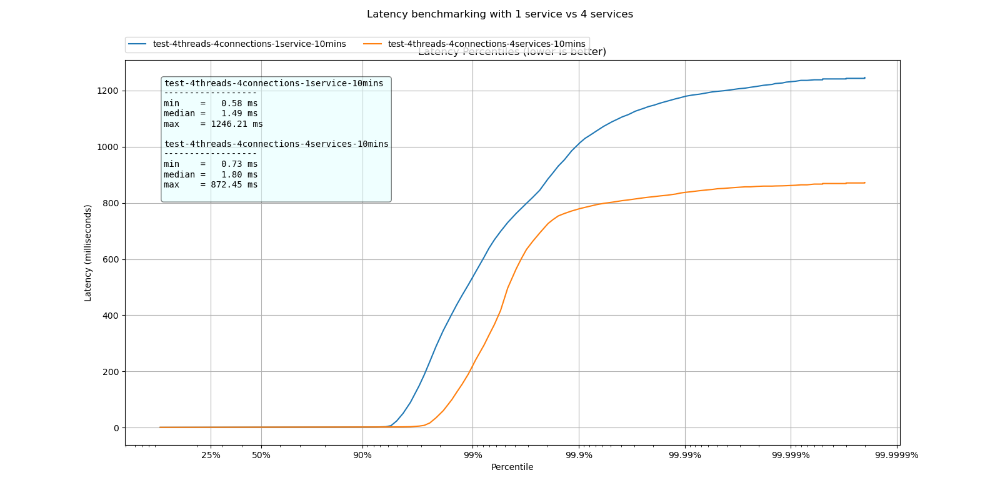

# Architecture overview

This example aims to implement an e-commerce shop.
The e-commerce shop's domain is rather simple model as it just comprises of customers, orders and products, but there is a high degree of complexity involved due to the fact that each domain is tightly coupled with each other.
Each customer is able to place orders for specific products, i.e. a customer has a list of orders they placed in the past, which each order having a list of products.
If each of these domains is implemented as a single microservice, that means that in order to place an order for a specific customer, the `OrderService` would have to ask the `CustomerService` if the specified customerId exists and repeat the same with the `ProductService` and the specified productId.
Without the right architectural practice, this could degrade into a tightly coupled system where each microservice would have to directly interact with the other ones in order to send HTTP requests on REST APIs.

This could quickly degrade into a unmaintable system if we imagine a bigger scope for our system, something like Amazon.
For a large amount of customers we would need to scale up our system from one instance to many instances, maybe even set up in different data centers closer to the individual customer's country.
The Operations department would have to work tightly with the Development department to figure out a way how multiple scaled up instances of our services can interact with each other without losing data consistency, making sure how each service can reach one of the multiple available instances other services it needs to interact with.

With the correct event-driven architecture, this gets drastically more simple, as none of the microservices are interacting with each other. They simply emit events that describe what has happened.
If a new customer has created themself an account on our shop, the `CustomerService` simply publishes an `CustomerCreatedEvent` to the event broker and each microservice subscribe to these events and perform the needed actions.
For example, a `OrderService` would subscribe to these `CustomerCreatedEvent`s to locally save the ids of created customer to make sure that orders cannot be created for an non-existent customer.
Scaling up multiple instances of a specific service is a non-factor then.
Multiple `CustomerService`s can simply be started, a load-balancer on top of these will figure how which one of these instances will handle the creation of the new customer and that instance will simply publish the appropriate event to the event bus.
Now, if we have scaled up the `OrderService` to multiple instances, they all can simply subscribe to this newly published event.

While the scope of this system is rather small and the example above could seem constructed specially to fit such a use case, one can still imagine the event-driven architecture being a valid architecture solution for such a system.

## Container diagram

The following diagram displays the whole event-driven system, including which microservices it is made of and how they are interacting.
It also shows a service discovery service, the `discovery-service`, and an API gateway service, the `gateway-service`.

These are used to:

* guard the microservices from direct communication from/to outside of the system, which allows operations to add an TLS termination proxy such that the microservices themselves are kept from the TLS overhead during communication;
* to implement service discovery and registration;
* to implement a form of load-balancing through the `discovery-service` as multiple microservices can register themselves and the `gateway-service` then asks the `discovery-service` for once instance of the needed service without needing to know how to reach every single instance.

This reference system has 4 microservices, each with their own database, all communicating through the centralized, shared event bus which is realized by the use of Apache Kafka.
Our Apache Kafka instance is the event bus but also our event store.
It permanently stores all the events that happened in our system through which the concept of "Event Sourcing" is realized.
We can recreate a projection of the needed domain data by consuming all appropriate Kafka topics.


## Container specifications

### FAVS-commerce self-implemented services

|                          Service Name                          | Spring Boot | Spring Cloud |  ORM  |   Messaging  |     Service Type     |
|:--------------------------------------------------------------:|:-----------:|:------------:|:-----:|:------------:|:--------------------:|
|              [customer-service][customer-service]              |    2.4.3    |   2020.0.1   | R2DBC | Apache Kafka |        Domain        |
|                 [order-service][order-service]                 |    2.4.3    |   2020.0.1   | R2DBC | Apache Kafka |        Domain        |
|       [product-command-service][product-command-service]       |    2.4.3    |   2020.0.1   | R2DBC | Apache Kafka |        Domain        |
|         [product-query-service][product-query-service]         |    2.4.3    |   2020.0.1   | R2DBC | Apache Kafka |        Domain        |
| [business-intelligence-service][business-intelligence-service] |    2.4.3    |   2020.0.1   |  N/A  | Apache Kafka |       Aggregate      |
|             [discovery-service][discovery-service]             |    2.4.3    |   2020.0.1   |  N/A  |      N/A     |    Netflix Eureka    |
|               [gateway-service][gateway-service]               |    2.4.3    |   2020.0.1   |  N/A  |      N/A     | Spring Cloud Gateway |

The `discovery-service` and `gateway-service` are special kind of "self-implemented" services.
While they would fit more into the following table, they are implemented by providing a self-built microservice that use Netflix Eureka or Spring Cloud Gateway as dependencies and are enabled by annotations.
This is needed because:

* for `gateway-service`, each system somehow needs to define their own routes, either via `application.yml` or a programmable way.
* for `discovery-service` and `gateway-service` you might want to define special profiles based on the environment in which you are launching them or want to add them into some kind of metrics-service like micrometer.io.

### Needed services for infrastructure purposes

|           Service Name          |                               Version                               |                  Service Type                 |
|:-------------------------------:|:-------------------------------------------------------------------:|:---------------------------------------------:|
|      [kafka][compose-file]      |                [confluentinc/cp-kafka:latest][kafka]                |    Message broker/event bus and event store   |
|    [zookeeper][compose-file]    |            [confluentinc/cp-zookeeper:latest][zookeeper]            | Hierarchical key-value store needed for Kafka |
| [schema-registry][compose-file] | [confluentinc/cp-schema-registry:latest][confluent-schema-registry] |      Central repository for data schemas      |
|   [customer-db][compose-file]   |                    [postgres:latest][postgresql]                    |                    Database                   |
|     [order-db][compose-file]    |                    [postgres:latest][postgresql]                    |                    Database                   |
|    [product-db][compose-file]   |                    [postgres:latest][postgresql]                    |                    Database                   |

## Used architectural concepts, explanations for these and their advantages w.r.t. to our system

### Load balancing

To successfully distribute load among the newly scaled up services a load balancing mechanism is needed.
This is solved in this system by including a service registry, the `discovery-service`, and a API gateway, the `gateway-service`.
How exactly this works is described in the following:
Newly started service instances register themselves with the service registry.
Clients of the system interact with the API gateway by a HTTP request on one of the REST API endpoints.
The API gateway routes the request to the corresponding service that is responsible for processing it.
To find out which of the available service instances should be used, the API gateway performs the service discovery by sending a request for the respective service to the service registry.
The service registry then responds with the network location of one of these instances.
In this case, the Netflix Eureka service registry uses a simplified round-robin algorithm to decide which service instance should be used.
This creates a simple client-side load balancing mechanism.

### Event Sourcing

An event store is represented in Kafka by what is called a "Topic".
On this topic events are exchanged by publishers and subscribers.
For the "FAVS-Commerce"-system, a topic was created for each domain entity.
Spring Cloud Stream allows the configuration of such a topic within the application configuration:

```application.xml
spring.cloud.stream.bindings.input.binder=kafka 
spring.cloud.stream.bindings.input.destination=product 
spring.cloud.stream.bindings.input.contentType=application/*+avro 
spring.cloud.stream.bindings.input.consumer.concurrency=1 
```

In addition, Kafka introduces the principle of "producer/consumer groups"
With the help of these it can be expressed whether competing or cooperating services are allowed to read all events at the same time, or whether only one service of these groups is able to do so.  
A naive approach would be to create a separate Kafka topic for each event type, on which only the respective event type is published, i.e. customer-updated-topic for CustomerUpdatedEvents.
This makes it possible for subscribers to get only the events they need, but makes it difficult for subscribers who want to consume all event types for this domain entity to do so in the right order.
This would require each subscriber to sort the events locally using a timestamp or similar identifier.
To avoid the need for each subscriber to perform potentially resource-intensive filtering and sorting to restore the correct order of events, we instead rely on a Kafka topic per domain entity.
On this topic all events are published, which are of interest for this domain.
This means, for example, that the event types "CustomerCreatedEvents", "CustomerUpdatedEvents" and "CustomerDeletedEvents" are published on the Kafka topic "customer" associated with the customer domain entity.
This way it is guaranteed that subscribers can be consumed the events in the same order as they actually occurred in the system.
Each of the Kafka topics; customer, order and product, therefore describes an append-only event store, through which the event sourcing pattern is implemented.
This structure can also be used to show how the event sourcing pattern favors the scalability of a specific service.

```bash
docker-compose up -d --scale product-query-service=4 
```

By executing this command, a horizontal scaling of the product query service is performed, which represents the CQRS read model of the product domain entity. To be exact, here 4 instances are booted up.
These newly created services fill their local data cache by consuming all events from the product topic.
This ensures that these service instances can represent the latest state.
In order for newly started services to be able to consume a Kafka Topic from the first event, the services must be further configured:

```xml
spring.cloud.stream.kafka.bindings.<channelName>.consumer.startOffset=earliest 
```

This sets the initial starting offset from which the events should be read to the earliest, normally offset zero.
Indicating that all events that ever occured on said topic need to be processed.
As an alternative to this configuration there is also a programmatic solution which is implemented in the FAVS commerce system because of a bug in the Spring Cloud Stream connector:

```java
public void onPartitionsAssigned( 
    String bindingName, 
    Consumer<?, ?> consumer, 
    Collection<TopicPartition> partitions, 
    boolean initial) { 
  if (initial) { 
    consumer.seekToBeginning(partitions); 
    consumer.resume(partitions); 
  } 
} 
```

This code can be found inside the `KafkaRebalanceListener` which is provided by the `service-commons` subproject.

### Command Query Responsibility Segregation

According to CQRS a service shall be split into a read and write model to show the usability of this pattern. Specifically for this system, it was identified that the product domain entity is read more often than it is written to, since customers browse the product catalog more often than third-party vendors add new products to it.
As an example, the "ProductService" was split into a "ProductCommandService" and a "ProductQueryService".
Thus it is feasible to develop, optimize and scale the write model, the write API but also the read model and the read API separately.
The "ProductQueryService" implements the retrieve operations and provides them via REST API endpoints and writes all necessary data into a local HashMap to mimic an in-memory database.
The "ProductCommandService", on the other hand, provides all create, update and delete operations and writes all received data to its own PostgreSQL instance.
In the following, we build upon the scenario presented in the previous chapter to show how CQRS furthermore favors increased scalability.
A benchmarking experiment can now be used to measure whether there are noticeable differences in latency.

```bash
latencyTest() {
    # Warming up JVM, CPU and RAM caches
    wrk2 -t4 -c4 -d30s -R1000 --latency http://0.0.0.0:9000/products/1
    wrk2 -t4 -c4 -d30s -R1000 --latency http://0.0.0.0:9000/products/1
    wrk2 -t4 -c4 -d30s -R1000 --latency http://0.0.0.0:9000/products/1
    wrk2 -t4 -c4 -d30s -R1000 --latency http://0.0.0.0:9000/products/1
    wrk2 -t4 -c4 -d30s -R1000 --latency http://0.0.0.0:9000/products/1
    wrk2 -t4 -c4 -d30s -R1000 --latency http://0.0.0.0:9000/products/1
    wrk2 -t4 -c4 -d30s -R1000 --latency http://0.0.0.0:9000/products/1
    wrk2 -t4 -c4 -d30s -R1000 --latency http://0.0.0.0:9000/products/1
    wrk2 -t4 -c4 -d30s -R1000 --latency http://0.0.0.0:9000/products/1
    # Producing the real latency test over 10 mins
    wrk2 -t4 -c4 -d600s -R1000 --latency http://0.0.0.0:9000/products/1
}
```

This script sends a HTTP GET request to the "/products/1" REST API endpoint of the product query service via 4 threads and 4 connections. A few runs are done to warm up the caches before conducting a 10 mins experiment.



### Database per Service pattern

Microservices ideally should be loosely coupled so that they can be developed, deployed and scaled independently.
For this use case it makes sense that each services has it's own database.
This way, the development team for each microservice can independently decide which database paradigm best fits their use case.

### Schema registry

A schema registry allows us to register the schemas for the concrete event types and the allowed event types for a specific Kafka topic by a union type.

This makes sure that it is impossible to publish unknown event types on a specific Kafka topic and allows independently, seperate event schema development.

The following sequence description explains how exactly a event publisher and subscriber uses such a schema-registry to ensure these advantages:

* The schema registry is filled with the appropriate event type schemas and union type schemas that describe which event types are allowed on a specific Kafka topic
* A service builds the Kafka message containing the specific event type and publishes it on the Kafka broker
* This producer requests the schema registry for the specific ID of a registered event schema
* With this schema, Avro serializes the specific event type using the schema
* Spring Cloud Stream then puts the schema-id in the message headers
* This message containing the specific event type is published on the Kafka topic
* When a subscriber consumes that specific event, it reads the schema-id from the message header in order to get the appropriate schema for said event type from the schema registry
* The subscriber finds class in their classpath that could represent that object and deserialized the message into it

(Source for this information, changed to fit our system)[schema-registry-avro-tutorial]

### Reactive Manifesto, Systems and Programming

All our services are implemented by functional reactive programming which is provided through Spring Webflux (for the REST API endpoints) which in turn uses [Project Reactor][projectreactor] which then implements the Reactive Streams specification, R2DBC (a reactive database driver) and Netty (non-blocking reactive web server).
Through all of these libraries and frameworks we are able to implement our services in a non-blocking, asynchronous way.
For this, each problem will be decomposed into multiple discrete, disjoint steps that can be executed in an asynchronous and nonblocking way.
These steps then are composed to form a workflow, i.e. solve the afore-decomposed problem.

This allows the architecture stated earlier to adhere to Reactive Manifesto recommendations as follows:  

* Elastic: the addition of new write and read model instances results in better performance; the event store is based on scalable data stores.
* Resilient: the loss of an instance of a write or read model does not prevent the system from working and the lost instance can be easily recovered; the  eventstore uses datastores with enabled replication.
* Message-driven: commands trigger events, events trigger model updates.
* Responsive: the entire system resolves user queries quickly by selecting the most performant query models that could be designed; aggregates in the write model are fully independent and can be easily cached, improving command resolution performance; the event store is highly optimised for append-only operations and event retrieval for a single aggregate.

By applying all of these architectural and programming model related concepts, we can build reactive systems that make low-latency, high-throughput workloads possible.

[projectreactor]: https://projectreactor.io/
[postgresql]: https://www.postgresql.org/
[spring]: https://spring.io/
[spring-boot]: https://spring.io/projects/spring-boot
[spring-r2dbc]: https://spring.io/projects/spring-data-r2dbc
[spring-cloud]: https://spring.io/projects/spring-cloud
[spring-cloud-stream]: https://docs.spring.io/spring-cloud-stream/docs/current/reference/html/
[zookeeper]: https://zookeeper.apache.org/
[confluent-schema-registry]: https://docs.confluent.io/platform/current/schema-registry/index.html
[schema-registry-avro-tutorial]: https://www.baeldung.com/spring-cloud-stream-kafka-avro-confluent
[kafka]: https://www.confluent.io/what-is-apache-kafka/
[compose-file]: ../application/docker-compose.yml
[customer-service]: ../application/services/business-services/customer-service
[product-command-service]: ../application/services/business-services/product-command-service
[product-query-service]: ../application/services/business-services/product-query-service
[order-service]: ../application/services/business-services/order-service
[business-intelligence-service]: ../application/services/business-services/business-intelligence-service
[discovery-service]: ../application/services/infrastructure-services/discovery-service
[gateway-service]: ../application/services/infrastructure-services/gateway-service
